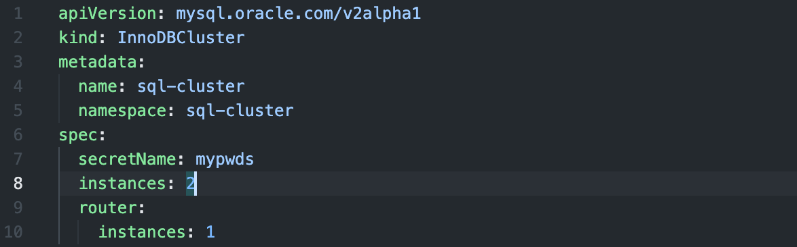

# Deploying a Scalable SQL Database Cluster

### Steps involved to Complete the Challenge

- Creating the Kubernetes Cluster on Digital Ocean
- Setting up MySQL Database and MySQL Operator
- Testing the Cluster Capabilities and Playing Around

### Creating the Kubernetes Cluster on Digital Ocean

Create a Kubernetes cluster. I selected Bangalore as my zone and renamed my cluster to sql-k8s-cluster and kept the rest of the fields as defualt. Once created, download the config file (mine was called ```sql-k8s-cluster-kubeconfig.yaml```) and run the following command in the terminal. 

```
cd ~/.kube && kubectl --kubeconfig="sql-k8s-cluster-kubeconfig.yaml" get nodes
```


### Setting up MySQL Database and MySQL Operator

Clone the MySQL Operator from the following link and ```cd``` into it. Once inside, run the below command.

```
helm install mysql-operator helm/mysql-operator --namespace mysql-operator --create-namespace --kubeconfig ~/.kube/sql-k8s-cluster-kubeconfig.yaml
```


We now create a namespace called ```sql-cluster``` by running the below command.

```
kubectl create namespace sql-cluster --kubeconfig ~/.kube/sql-k8s-cluster-kubeconfig.yaml
```


After that we set the username and password via the following command.

```
kubectl create secret generic mypwds --from-literal=rootUser=root --from-literal=rootHost=%         --from-literal=rootPassword="k8s-sql" --namespace sql-cluster --kubeconfig ~/.kube/sql-k8s-cluster-kubeconfig.yaml
```


We now write the configuration in our ```config.yaml``` file with the following details.

```
kubectl apply -f config.yaml --kubeconfig ~/.kube/sql-k8s-cluster-kubeconfig.yaml
```


We can see our clusters and their status by running the below command in our terminal.

```
kubectl get innodbcluster --watch  --namespace sql-cluster --kubeconfig ~/.kube/sql-k8s-cluster-kubeconfig.yaml
```


We can get the service details by running the following commands.

```
kubectl get service sql-cluster  --namespace sql-cluster --kubeconfig ~/.kube/sql-k8s-cluster-kubeconfig.yaml
```

```
kubectl describe service sql-cluster  --namespace sql-cluster --kubeconfig ~/.kube/sql-k8s-cluster-kubeconfig.yaml
```


We make the cluster accessible by forwarding it to a port and accessing it via an SQL Client.

```
kubectl port-forward service/sql-cluster mysql  --namespace sql-cluster --kubeconfig ~/.kube/sql-k8s-cluster-kubeconfig.yaml
```


### Testing the Cluster Capabilities and Playing Around

In order to see how the cluster scales, we can modify the ```config.yaml``` and see how the changes are made.

```
kubectl apply -f config.yaml --kubeconfig ~/.kube/sql-k8s-cluster-kubeconfig.yaml
```



```
kubectl get innodbcluster --watch  --namespace sql-cluster kubeconfig ~/.kube/sql-k8s-cluster-kubeconfig.yaml
```


Another way to test our cluster is by deleting a pod in our cluster and seeing how it fares.

```
kubectl delete -n sql-cluster pod sql-cluster-0
```


With that, we have successfully created a scalable SQL cluster.

