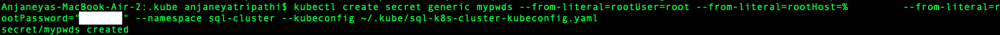
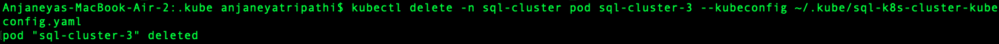

# Deploying a Scalable SQL Database Cluster

## Steps involved to Complete the Challenge

- Creating the Kubernetes Cluster on Digital Ocean
- Setting up MySQL Database and MySQL Operator
- Testing the Cluster Capabilities and Playing Around

## Creating the Kubernetes Cluster on Digital Ocean

Create a Kubernetes cluster. I selected Bangalore as my zone and renamed my cluster to sql-k8s-cluster and kept the rest of the fields as defualt. Once created, download the config file (mine was called ```sql-k8s-cluster-kubeconfig.yaml```) and run the following command in the terminal. 

```
cd ~/.kube && kubectl --kubeconfig="sql-k8s-cluster-kubeconfig.yaml" get nodes
```


## Setting up MySQL Database and MySQL Operator

Clone the MySQL Operator from the following link and ```cd``` into it. Once inside, run the below command.

```
helm install mysql-operator helm/mysql-operator --namespace mysql-operator --create-namespace --kubeconfig ~/.kube/sql-k8s-cluster-kubeconfig.yaml
```


We now create a namespace called ```sql-cluster``` by running the below command.

```
kubectl create namespace sql-cluster --kubeconfig ~/.kube/sql-k8s-cluster-kubeconfig.yaml
```


After that we set the username and password via the following command.

```
kubectl create secret generic mypwds --from-literal=rootUser=root --from-literal=rootHost=%         --from-literal=rootPassword="k8s-sql" --namespace sql-cluster --kubeconfig ~/.kube/sql-k8s-cluster-kubeconfig.yaml
```



We now write the configuration in our ```config.yaml``` file with the following details.

```yaml
apiVersion: mysql.oracle.com/v2alpha1
kind: InnoDBCluster
metadata:
  name: sql-cluster
  namespace: sql-cluster
spec:
  secretName: mypwds
  instances: 3
  router:
    instances: 1
 ```

```
kubectl apply -f config.yaml --kubeconfig ~/.kube/sql-k8s-cluster-kubeconfig.yaml
```


We can see our clusters and their status by running the below command in our terminal.

```
kubectl get innodbcluster --watch  --namespace sql-cluster --kubeconfig ~/.kube/sql-k8s-cluster-kubeconfig.yaml
```


We can get the service details by running the following commands.

```
kubectl get service sql-cluster  --namespace sql-cluster --kubeconfig ~/.kube/sql-k8s-cluster-kubeconfig.yaml
kubectl describe service sql-cluster  --namespace sql-cluster --kubeconfig ~/.kube/sql-k8s-cluster-kubeconfig.yaml
```


We make the cluster accessible by forwarding it to a port and accessing it via an SQL Client.

```
kubectl port-forward service/sql-cluster mysql  --namespace sql-cluster --kubeconfig ~/.kube/sql-k8s-cluster-kubeconfig.yaml
```


We can now see the SQL cluster is available on port 6446. By running the below command, we can open the mysql shell.

```
mysql -h127.0.0.1 -P6446 -uroot -p
```

You'll be asked to enter a password, which will be the password you set earlier.


## Testing the Cluster Capabilities and Playing Around

Let us add some data before we test the resilience and scalability of our cluster.

```sql
CREATE TABLE students (id INT(3) PRIMARY KEY, name VARCHAR(20) NOT NULL, dept VARCHAR(5) NOT NULL);

INSERT INTO user (1, "Anjaneya", "CSE");

SELECT * FROM students;
```


Now, let us test the resilience and scalablility of our cluster!

### Resilience

Let us delete a pod (the one which stores the above table) and see if the data is retained or not. The pod which stores the data is identified by running the following command. 

```sql
SHOW VARIABLES WHERE Variable_name = 'hostname';
```

We get the response as ```sql-cluster-3```. In order to delete this particular pod, we execute the below command in a separate terminal window. 

```
kubectl delete -n sql-cluster pod sql-cluster-3
```



Know let us see how our database fares.


Woah! Our data is still available! Pretty cool isn't it? 🥳

We can see the MySQL server lose connection, identify that the connection is lost and then reconnect to another instance and show us our data as if nothing happened.

We can also watch how a new pod is created after the deletion of the previous one.


### Scalability

In order to see how the cluster scales, we can modify the ```config.yaml``` and see how the changes are made. Let us change the number of instances from 3 to 4.

```yaml
apiVersion: mysql.oracle.com/v2alpha1
kind: InnoDBCluster
metadata:
  name: sql-cluster
  namespace: sql-cluster
spec:
  secretName: mypwds
  instances: 4
  router:
    instances: 1
 ```

```
kubectl apply -f config.yaml --kubeconfig ~/.kube/sql-k8s-cluster-kubeconfig.yaml
```

```
kubectl get innodbcluster --watch  --namespace sql-cluster kubeconfig ~/.kube/sql-k8s-cluster-kubeconfig.yaml
```


Kubernetes realises that the actual state is different from the desired state and immediately starts working on achieving the desired state.

With that, we have successfully created a scalable SQL cluster.
